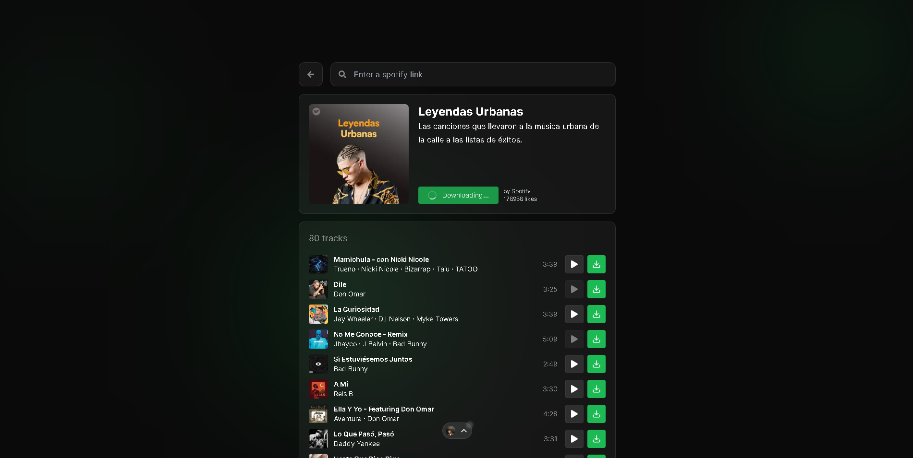

<br/>
<p align="center">
  <a href="https://github.com/jtayped/spotify-downloader">
    
  </a>

  <h3 align="center">Spotify Downloader</h3>

  <p align="center">
    A website where you can download Spotify playlists or tracks, developed with Next JS.
    <br/>
    <br/>
    <a href="https://github.com/jtayped/spotify-downloader"><strong>Explore the docs »</strong></a>
    <br/>
    <br/>
    <a href="https://spotifydownload.net/">View Demo</a>
    .
    <a href="https://github.com/jtayped/spotify-downloader/issues">Report Bug</a>
    .
    <a href="https://github.com/jtayped/spotify-downloader/issues">Request Feature</a>
  </p>
</p>

  

## Table Of Contents

- [About the Project](#about-the-project)
- [Built With](#built-with)
- [Getting Started](#getting-started)
  - [Prerequisites](#prerequisites)
  - [Installation](#installation)
- [Usage](#usage)
- [Roadmap](#roadmap)
- [Contributing](#contributing)
- [License](#license)

## About The Project



A handy tool for Spotify lovers. It has a simple layout, lets you listen to a song before saving it, and adds metadata to your downloads. It saves you time organizing your music. Give it a try!

## Built With

This app is built with Next JS, utilising modules such as: ytdl-core, youtube-sr, and most notably ffmpeg.wasm.

## Getting Started

First, run the development server:

```sh
npm run dev
# or
yarn dev
# or
pnpm dev
# or
bun dev
```

### Prerequisites

You must have Node JS installed

### Installation

1. Aquire a Spotify Client ID and Secret from a Spotify API app.
2. Create an env file ".env.local" and add each one to CLIENT_ID & CLEINT_SECRET.
3. Open https://localhost:3000 with your browser to see the result.

## Usage

When greeted at the home screen, enter a playlist or track link. On load, you will be able to download all the available content. If you have any doubts, you can preview the track by simply playing it in the UI.

## Roadmap

See the [open issues](https://github.com/jtayped/spotify-downloader/issues) for a list of proposed features (and known issues).

## Contributing

Contributions are what make the open source community such an amazing place to be learn, inspire, and create. Any contributions you make are **greatly appreciated**.

- If you have suggestions for adding or removing projects, feel free to [open an issue](https://github.com/jtayped/spotify-downloader/issues/new) to discuss it, or directly create a pull request after you edit the _README.md_ file with necessary changes.
- Please make sure you check your spelling and grammar.
- Create individual PR for each suggestion.
- Please also read through the [Code Of Conduct](https://github.com/jtayped/spotify-downloader/blob/main/CODE_OF_CONDUCT.md) before posting your first idea as well.

### Creating A Pull Request

1. Fork the Project
2. Create your Feature Branch (`git checkout -b feature/AmazingFeature`)
3. Commit your Changes (`git commit -m 'Add some AmazingFeature'`)
4. Push to the Branch (`git push origin feature/AmazingFeature`)
5. Open a Pull Request

## License

Distributed under the MIT License. See [LICENSE](https://github.com/jtayped/spotify-downloader/blob/main/LICENSE.md) for more information.
